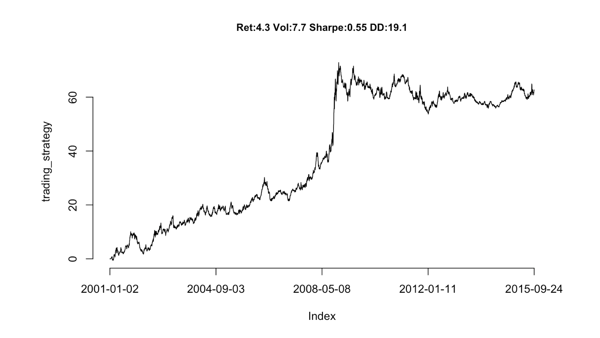
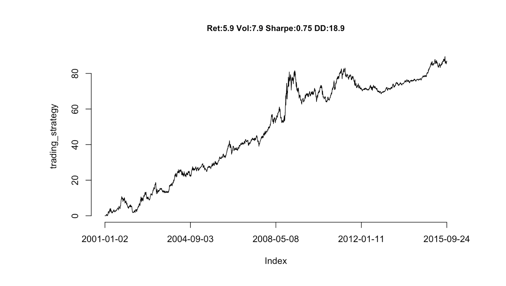

<br>

The purpose of this exercise is to become familiar with:

1. Some time series analysis tools;
2. Correlation matrices and principal component analysis (PCA) (see [readings of sessions 3-4](http://inseaddataanalytics.github.io/INSEADAnalytics/CourseSessions/Sessions23/FactorAnalysisReading.html));
3. More data manipulation and reporting tools (including Google Charts).

As always, while doing this exercise we will also see how to generate replicable and customizable reports. For this purpose the exercise uses the R Markdown capabilities (see [Markdown Cheat Sheet](https://www.rstudio.com/wp-content/uploads/2015/02/rmarkdown-cheatsheet.pdf) or a [basic introduction to R Markdown](http://rmarkdown.rstudio.com/authoring_basics.html)).  These capabilities allow us to create dynamic reports. For example today's date is `r Sys.Date()` (you need to see the .Rmd to understand that this is *not* a static typed-in date but it changes every time you compile the .Rmd - if the date changed of course).

Before starting, make sure you have pulled the [exercise set 2 souce code files](https://github.com/InseadDataAnalytics/INSEADAnalytics/tree/master/Exercises/Exerciseset2)  on your github repository (if you pull the course github repository you also get the exercise set files automatically). Moreover, make sure you are in the directory of this exercise. Directory paths may be complicated, and sometimes a frustrating source of problems, so it is recommended that you use these R commands to find out your current working directory and, if needed, set it where you have the main files for the specific exercise/project (there are other ways, but for now just be aware of this path issue). For example, assuming we are now in the "Data Analytics R version/INSEADAnalytics" directory, we can do these: 

```{r echo=TRUE, eval=FALSE, tidy=TRUE}
#getwd()

#setwd("Exercises/Exerciseset2/")

#list.files()
```

**Note:** as always, you can use the `help` command in Rstudio to find out about any R function (e.g. type `help(list.files)` to learn what the R function `list.files` does).

Let's now see the exercise. 

**IMPORTANT:** You should answer all questions by simply adding your code/answers in this document through editing the file ExerciseSet2.Rmd and then clicking on the "Knit HTML" button in RStudio.  Once done, please post your .Rmd and html files in your github repository. 

<hr>

### The Exercise: Introduction

For this exercise we will use the Futures' daily returns  to develop what is considered to be a *"classic" hedge fund trading strategy*, a **futures trend following strategy**. There is a lot written about this, so it is worth doing some online search about "futures trend following", or "Managed Futures", or "Commodity Trading Advisors (CTA)". There is about **[$300 billion](http://www.barclayhedge.com/research/indices/cta/Money_Under_Management.html)** invested on this strategy today, and is considered to be one of the **oldest hedge fund strategies**. Some example links are:

* [A fascinating report on 2 centuries of trend following from the CFM hedge - a $6 billion fund](https://www.trendfollowing.com/whitepaper/Two_Centuries_Trend_Following.pdf)
* [Another fascinating report on 1 century of trend following investing from AQR - a $130 billion fund](https://www.aqr.com/library/aqr-publications/a-century-of-evidence-on-trend-following-investing)
* [Wikipedia on CTAs](https://en.wikipedia.org/wiki/Commodity_trading_advisor)
* [Morningstar on CTAs](http://www.morningstar.co.uk/uk/news/69379/commodity-trading-advisors-(cta)-explained.aspx)
* [A report](http://perspectives.pictet.com/wp-content/uploads/2011/01/Trading-Strategies-Final.pdf)
* [Man AHL (a leading hedge fund on CTAs - among others) - an $80 billion fund](https://www.ahl.com)

Of course there are also many starting points for developing such a strategy (for example [this R bloggers one](http://www.r-bloggers.com/system-from-trend-following-factors/) (also on [github](https://gist.github.com/timelyportfolio/2855303)), or the [turtle traders website](http://turtletrader.com) which has many resources. 

In this exercise we will develop our own strategy from scratch.  

*Note (given today's market conditions):* **Prices of commodities, like oil or gold, can be excellent indicators of the health of the economy and of various industries, as we will also see below**.

### Getting the Futures Data

There are many ways to get futures data. For example, one can use  the [Quandl package,](https://www.quandl.com/browse) or the [turtle traders resources,](http://turtletrader.com/hpd/) or (for INSEAD only) get data from  the [INSEAD library finance data resources](http://sites.insead.edu/library/E_resources/ER_subject.cfm#Stockmarket) website. One has to pay attention on how to create continuous time series from underlying contracts with varying deliveries (e.g. see [here](https://www.quantstart.com/articles/Continuous-Futures-Contracts-for-Backtesting-Purposes) ). Using a combination of the resources above, we will use data for a number of commodities. 


### Data description

Let's load the data and see what we have. 

```{r echo=TRUE, eval=TRUE, comment=NA, warning=FALSE,error=FALSE, message=FALSE, prompt=FALSE, tidy=TRUE}
source("helpersSet2.R")
library(googleVis)
load("data/FuturesTrendFollowingData.Rdata")
```

<br>
We have data from `r head(rownames(futures_data),1)` to `r tail(rownames(futures_data),1)` of daily returns for the following `r ncol(futures_data)` futures: 

<br>

```{r echo=TRUE, eval=TRUE, comment=NA, warning=FALSE,error=FALSE, message=FALSE, prompt=FALSE, tidy=TRUE, results='asis'}
show_data = data.frame(colnames(futures_data))
m1<-gvisTable(show_data,options=list(showRowNumber=TRUE,width=1920, height=min(400,27*(nrow(show_data)+1)),allowHTML=TRUE,page='disable'))
print(m1,'chart')
```
<br> 


### Basic data analysis

Let's see how these are correlated. Let's also make it look nicer (than, say, what we did in Exercise Set 1), using [Google Charts](https://code.google.com/p/google-motion-charts-with-r/wiki/GadgetExamples) (see examples online, e.g. [examples](https://cran.r-project.org/web/packages/googleVis/vignettes/googleVis_examples.html) and the [R package used used](https://cran.r-project.org/web/packages/googleVis/googleVis.pdf) ).The correlation matrix is as follows (note that the table is "dynamic": for example you can sort it based on each column by clicking on the column's header)

<br>


```{r echo=FALSE, comment=NA, warning=FALSE, message=FALSE, results='asis'}
show_data = data.frame(cbind(colnames(futures_data), round(cor(futures_data),2)))
m1<-gvisTable(show_data,options=list(width=1920, height=min(400,27*(nrow(show_data)+1)),allowHTML=TRUE))
print(m1,'chart')
```

<br>

We see quite high correlations among some of the futures. Does it make sense? Why? Do you see some negative correlations? Do those make sense? 

<b>Answer:</b>
Soybean processed products are correlated with soybean <br>
Crude oil is correlated with brent and heated oil <br>
CAC40 is highly correlated with Eurostoxx indicator <br>
It make sense as for example soybean oil is made of soybean and hence follow the same price trends.<br>
Canadian dollar futures is negatively correlated to Australian and NZ dollar and British pound. Maybe, the investors bet on Can$ when the other economies go down.<br>

Given such high correlations, we can try to see whether there are some "principal components" (see [reading on dimensionality reduction](http://inseaddataanalytics.github.io/INSEADAnalytics/CourseSessions/Sessions23/FactorAnalysisReading.html)). This analysis can also indicate whether all futures (the global economy!) are driven by some common "factors" (let's call them **"risk factors"**). 

<br>

```{r echo=TRUE, eval=TRUE, comment=NA, warning=FALSE,error=FALSE, message=FALSE, prompt=FALSE, tidy=TRUE}
Variance_Explained_Table_results<-PCA(futures_data, graph=FALSE)
Variance_Explained_Table<-cbind(paste("component",1:ncol(futures_data),sep=" "),Variance_Explained_Table_results$eig)
Variance_Explained_Table<-as.data.frame(Variance_Explained_Table)
colnames(Variance_Explained_Table)<-c("Component","Eigenvalue", "Percentage_of_explained_variance", "Cumulative_percentage_of_explained_variance")
```

```{r echo=FALSE, comment=NA, warning=FALSE, message=FALSE, results='asis'}
show_data = data.frame(Variance_Explained_Table)
m1<-gvisTable(show_data,options=list(width=1920, height=min(400,27*(nrow(show_data)+1)),allowHTML=TRUE,page='disable'),formats=list(Eigenvalue="#.##",Percentage_of_explained_variance="#.##",Cumulative_percentage_of_explained_variance="#.##"))
print(m1,'chart')
```
<br> 

Here is the scree plot (see Sessions 3-4 readings):
<br>

```{r echo=TRUE, eval=TRUE, comment=NA, warning=FALSE,error=FALSE, message=FALSE, prompt=FALSE, tidy=TRUE}
eigenvalues  <- Variance_Explained_Table[,2]
```

```{r Fig1, echo=FALSE, comment=NA, results='asis', message=FALSE, fig.align='center', fig=TRUE}
df           <- cbind(as.data.frame(eigenvalues), c(1:length(eigenvalues)), rep(1, length(eigenvalues)))
colnames(df) <- c("eigenvalues", "components", "abline")
Line         <- gvisLineChart(as.data.frame(df), xvar="components", yvar=c("eigenvalues","abline"), options=list(title='Scree plot', legend="right", width=900, height=600, hAxis="{title:'Number of Components', titleTextStyle:{color:'black'}}", vAxes="[{title:'Eigenvalues'}]",  series="[{color:'green',pointSize:3, targetAxisIndex: 0}]"))
print(Line, 'chart')
```

<br>

Let's now see how the 20 first (**rotated**) principal components look like. Let's also use the *rotated* factors (note that these are not really the "principal component", as explained in the [reading on dimensionality reduction](http://inseaddataanalytics.github.io/INSEADAnalytics/CourseSessions/Sessions23/FactorAnalysisReading.html)) and not show any numbers less than 0.3 in absolute value, to avoid cluttering. Note again that you can sort the table according to any column by clicking on the header of that column. 
<br>

```{r echo=TRUE, comment=NA, warning=FALSE, error=FALSE,message=FALSE,results='asis',tidy=TRUE}
corused = cor(futures_data[,apply(futures_data!=0,2,sum) > 10, drop=F])
Rotated_Results<-principal(corused, nfactors=20, rotate="varimax",score=TRUE)
Rotated_Factors<-round(Rotated_Results$loadings,2)
Rotated_Factors<-as.data.frame(unclass(Rotated_Factors))
colnames(Rotated_Factors)<-paste("Component",1:ncol(Rotated_Factors),sep=" ")

sorted_rows <- sort(Rotated_Factors[,1], decreasing = TRUE, index.return = TRUE)$ix
Rotated_Factors <- Rotated_Factors[sorted_rows,]
Rotated_Factors[abs(Rotated_Factors) < 0.3]<-NA
```

```{r echo=FALSE, comment=NA, warning=FALSE, error=FALSE,message=FALSE,results='asis'}
show_data <- Rotated_Factors 
show_data<-cbind(rownames(show_data),show_data)
colnames(show_data)<-c("Variables",colnames(Rotated_Factors))
m1<-gvisTable(show_data,options=list(showRowNumber=TRUE,width=1220, height=min(400,27*(nrow(show_data)+1)),allowHTML=TRUE,page='disable'))
print(m1,'chart')
```
<br> 

#### Questions:

1. How many principal components ("factors") do we need to explain at least 50% of the variance in this data?
2. What are the highest weights (in absolute value) of the first principal component portfolio above on the `r ncol(futures_data)` futures? 
3. Can we interpret the first 10 components? How would you call these factors?
4. Can you now generate the principal components and scree plot using only: a) the pre-crisis bull market years (e.g. only using the data between November 1, 2002, and October 1, 2007)?  b) the financial crisis years (e.g. only using the data between October 1, 2007 and  March 1, 2009), 
4(Hint: you can select subsets of the data using for example the command `crisis_data = futures_data[as.Date(rownames(futures_data)) > "2007-10-01" & as.Date(rownames(futures_data)) < "2009-03-01", ])
5. Based on your analysis in question 3, please discuss any differences you observe about the futures returns during  bull and bear markets.  What implications may these results have? What do the results imply about how assets are correlated during bear years compared to bull years? 
6. (Extra - optional) Can you create an interactive (shiny based) tool so that we can study how the "**risk factors**" change ove time? (Hint: see [Exercise set 1](https://github.com/InseadDataAnalytics/INSEADAnalytics/blob/master/Exercises/Exerciseset1/ExerciseSet1.Rmd) and online resources on [Shiny](http://rmarkdown.rstudio.com/authoring_shiny.html) such as these [Shiny lessons](http://shiny.rstudio.com/tutorial/lesson1/). Note however that you may need to pay attention to various details e.g. about how to include Google Charts in Shiny tools - so keep this extra exercise for later!).

<br>

**Your Answers here:**
<br>
1. At least 6 first components. <br>
2. 5-Yr T-Notes Us & 10-Yr T-Notes have both 0.93 wieght for first component <br>
3. First 10 components could be interpreted in the following way: <br>
Component 1: Treasury bonds of US, Canada and to a lesser extent Europe <br>
Component 2: Currencies, Gold and Silver <br>
Component 3: Euro Stock markets indexes <br>
Component 4: US Stock markets indexes <br>
Component 5: European treasury bonds and Euribor rates <br>
Component 6: Gas & Oil <br>
Component 7: Metals <br>
Component 8: Agriculture <br>
Component 9: Rich metals <br>
Component 10: Asian Stock markets indexes <br>
<br>
4.a) the pre-crisis bull market years (e.g. only using the data between November 1, 2002, and October 1, 2007) <br>
Principal Components Analysis for Bull Years
```{r echo=FALSE, comment=NA, warning=FALSE, error=FALSE,message=FALSE,results='asis'}
bull_data = futures_data[as.Date(rownames(futures_data)) > "2002-11-01" & as.Date(rownames(futures_data)) < "2007-10-01", ]
Variance_Explained_Table_results_bull<-PCA(bull_data, graph=FALSE)
Variance_Explained_Table_bull<-cbind(paste("component",1:ncol(bull_data),sep=" "),Variance_Explained_Table_results_bull$eig)
Variance_Explained_Table_bull<-as.data.frame(Variance_Explained_Table_bull)
colnames(Variance_Explained_Table_bull)<-c("Component","Eigenvalue", "Percentage_of_explained_variance", "Cumulative_percentage_of_explained_variance")

show_data_bull = data.frame(Variance_Explained_Table_bull)
m1_bull<-gvisTable(show_data_bull,options=list(width=1920, height=min(400,27*(nrow(show_data_bull)+1)),allowHTML=TRUE,page='disable'),formats=list(Eigenvalue="#.##",Percentage_of_explained_variance="#.##",Cumulative_percentage_of_explained_variance="#.##"))
print(m1_bull,'chart')
```
<br> 
Scree plot for Bull Years (2002-2007)
```{r echo=TRUE, eval=TRUE, comment=NA, warning=FALSE,error=FALSE, message=FALSE, prompt=FALSE, tidy=TRUE}
eigenvalues_bull  <- Variance_Explained_Table_bull[,2]
```
```{r Fig2, echo=FALSE, comment=NA, results='asis', message=FALSE, fig.align='center', fig=TRUE}
df_bull           <- cbind(as.data.frame(eigenvalues_bull), c(1:length(eigenvalues_bull)), rep(1, length(eigenvalues_bull)))
colnames(df_bull) <- c("eigenvalues", "components", "abline")
Line_bull         <- gvisLineChart(as.data.frame(df_bull), xvar="components", yvar=c("eigenvalues","abline"), options=list(title='Screen plot (Bull Years)', legend="right", width=900, height=600, hAxis="{title:'Number of Components', titleTextStyle:{color:'black'}}", vAxes="[{title:'Eigenvalues'}]",  series="[{color:'green',pointSize:3, targetAxisIndex: 0}]"))
print(Line_bull, 'chart')
```
<br>
<br><b>
Rotated principal components - Bull</b>
```{r echo=TRUE, comment=NA, warning=FALSE, error=FALSE,message=FALSE,results='asis',tidy=TRUE}
corused_bull = cor(bull_data[,apply(bull_data!=0,2,sum) > 10, drop=F])
Rotated_Results_bull<-principal(corused_bull, nfactors=10, rotate="varimax",score=TRUE)
Rotated_Factors_bull<-round(Rotated_Results_bull$loadings,2)
Rotated_Factors_bull<-as.data.frame(unclass(Rotated_Factors_bull))
colnames(Rotated_Factors_bull)<-paste("Component",1:ncol(Rotated_Factors_bull),sep=" ")

sorted_rows_bull <- sort(Rotated_Factors_bull[,1], decreasing = TRUE, index.return = TRUE)$ix
Rotated_Factors_bull <- Rotated_Factors_bull[sorted_rows,]
Rotated_Factors_bull[abs(Rotated_Factors_bull) < 0.3]<-NA
```

```{r echo=FALSE, comment=NA, warning=FALSE, error=FALSE,message=FALSE,results='asis'}
show_data_bull <- Rotated_Factors_bull 
show_data_bull<-cbind(rownames(show_data_bull),show_data_bull)
colnames(show_data_bull)<-c("Variables",colnames(Rotated_Factors_bull))
m1_bull<-gvisTable(show_data_bull,options=list(showRowNumber=TRUE,width=1220, height=min(400,27*(nrow(show_data_bull)+1)),allowHTML=TRUE,page='disable'))
print(m1_bull,'chart')
```
<br> 


<br>
<b>b) the Crisis market years (e.g. only using the data between October 1, 2007 and  March 1, 2009) <br>
Principal Components Analysis for Crisis Years</b> 
```{r echo=FALSE, comment=NA, warning=FALSE, error=FALSE,message=FALSE,results='asis'}
crisis_data = futures_data[as.Date(rownames(futures_data)) > "2007-10-01" & as.Date(rownames(futures_data)) < "2009-03-01", ]
Variance_Explained_Table_results_crisis<-PCA(crisis_data, graph=FALSE)
Variance_Explained_Table_crisis<-cbind(paste("component",1:ncol(crisis_data),sep=" "),Variance_Explained_Table_results_crisis$eig)
Variance_Explained_Table_crisis<-as.data.frame(Variance_Explained_Table_crisis)
colnames(Variance_Explained_Table_crisis)<-c("Component","Eigenvalue", "Percentage_of_explained_variance", "Cumulative_percentage_of_explained_variance")

show_data_crisis = data.frame(Variance_Explained_Table_crisis)
m1_crisis<-gvisTable(show_data_crisis,options=list(width=1920, height=min(400,27*(nrow(show_data_crisis)+1)),allowHTML=TRUE,page='disable'),formats=list(Eigenvalue="#.##",Percentage_of_explained_variance="#.##",Cumulative_percentage_of_explained_variance="#.##"))
print(m1_crisis,'chart')
```
<br> 
<b>Screen plot for Crisis Years (2007-2009)</b>
```{r echo=TRUE, eval=TRUE, comment=NA, warning=FALSE,error=FALSE, message=FALSE, prompt=FALSE, tidy=TRUE}
eigenvalues_crisis  <- Variance_Explained_Table_crisis[,2]
```
```{r Fig3, echo=FALSE, comment=NA, results='asis', message=FALSE, fig.align='center', fig=TRUE}
df_crisis           <- cbind(as.data.frame(eigenvalues_crisis), c(1:length(eigenvalues_crisis)), rep(1, length(eigenvalues_crisis)))
colnames(df_crisis) <- c("eigenvalues", "components", "abline")
Line_crisis         <- gvisLineChart(as.data.frame(df_crisis), xvar="components", yvar=c("eigenvalues","abline"), options=list(title='Screen plot (Crisis Years)', legend="right", width=900, height=600, hAxis="{title:'Number of Components', titleTextStyle:{color:'black'}}", vAxes="[{title:'Eigenvalues'}]",  series="[{color:'green',pointSize:3, targetAxisIndex: 0}]"))
print(Line_crisis, 'chart')
```
<br><b>
Rotated principal components - Crisis</b>
```{r echo=TRUE, comment=NA, warning=FALSE, error=FALSE,message=FALSE,results='asis',tidy=TRUE}
corused_crisis = cor(crisis_data[,apply(crisis_data!=0,2,sum) > 10, drop=F])
Rotated_Results_crisis<-principal(corused_crisis, nfactors=10, rotate="varimax",score=TRUE)
Rotated_Factors_crisis<-round(Rotated_Results_crisis$loadings,2)
Rotated_Factors_crisis<-as.data.frame(unclass(Rotated_Factors_crisis))
colnames(Rotated_Factors_crisis)<-paste("Component",1:ncol(Rotated_Factors_crisis),sep=" ")

sorted_rows_crisis <- sort(Rotated_Factors_crisis[,1], decreasing = TRUE, index.return = TRUE)$ix
Rotated_Factors_crisis <- Rotated_Factors_crisis[sorted_rows,]
Rotated_Factors_crisis[abs(Rotated_Factors_crisis) < 0.3]<-NA
```

```{r echo=FALSE, comment=NA, warning=FALSE, error=FALSE,message=FALSE,results='asis'}
show_data_crisis <- Rotated_Factors_crisis 
show_data_crisis<-cbind(rownames(show_data_crisis),show_data_crisis)
colnames(show_data_crisis)<-c("Variables",colnames(Rotated_Factors_crisis))
m1_crisis<-gvisTable(show_data_crisis,options=list(showRowNumber=TRUE,width=1220, height=min(400,27*(nrow(show_data_crisis)+1)),allowHTML=TRUE,page='disable'))
print(m1_crisis,'chart')
```
<br> 
<br>
5. First of all it is important to notice that components calculated for each of the datasets (bull, crisis, all years) are different. For example Component1 for overall period is mostly composed of Treasury notes, for Bull & Crisis years of currencies, gold and silver. Tresury notes are responsible for 12.5% of variance in bull years, and only for 3.83% of variance during crisis years. Furthermore: <br>
Bull years: <b>6 first </b> components are resposnible for more than 50% of variance
Crisis years: <b>4 first </b>components are resposnible for more than 50% of variance
During crisis years most variables-assets lose value at the same time and will this be more correlated. Therefore, in Crisis years less components are required to explain the variance of the date than in the Bull years.
<hr>

### A Simple Futures Trend Following Strategy

We can now develop a simple futures trend following trading strategy, as outlined in the papers in the Exercise Introduction above. There are about $300 billion invested in such strategies! Of course we cannot develop here a sophisticated product, but with some more work... 

We will do the following: 

1. Calculate a number of moving averages of different "window lengths" for each of the `r ncol(futures_data)` futures - there are [many](http://www.r-bloggers.com/stock-analysis-using-r/) so called [technical indicators](http://www.investopedia.com/active-trading/technical-indicators/) one can use. We will use  the  "moving average" function `ma` for this (try for example to see what this returns `ma(1:10,2)` ). 
2. Add the signs (can also use the actual moving average values of course - try it!) of these moving averages (as if they "vote"), and then scale this sum across all futures so that the sum of their (of the sum across all futures!) absolute value across all futures is 1 (hence we invest $1 every day - you see why?).
3. Then invest every day in each of the `r ncol(futures_data)` an amount that is defined by the weights calculated in step 2, using however the weights calculated using data until 2 days ago (why 2 days and not 1 day?) - see the use of the helper function `shift` for this. 
4. Finally see the performance of this strategy. 

Here is the code. 
<br>

```{r echo=TRUE, eval=TRUE, comment=NA, warning=FALSE,error=FALSE, message=FALSE, prompt=FALSE, tidy=TRUE}
signal_used = 0*futures_data # just initialize the trading signal to be 0
# Take many moving Average (MA) Signals and let them "vote" with their sign (+-1, e.g. long or short vote, for each signal)
MAfreq<-seq(10,350,by=20)
for (iter in 1:length(MAfreq))
  signal_used = signal_used + sign(apply(futures_data,2, function(r) ma(r,MAfreq[iter])))
# Now make sure we invest $1 every day (so the sum of the absolute values of the weights is 1 every day)
signal_used = t(apply(signal_used,1,function(r) {
  res = r  
  if ( sum(abs(r)) !=0 )
    res = r/sum(abs(r))
  res
}))
colnames(signal_used) <- colnames(futures_data)
# Now create the returns of the strategy for each futures time series
strategy_by_future <- scrub(shift(signal_used,2)*futures_data) # use the signal from 2 days ago
# finally, this is our futures trend following strategy
trading_strategy = apply(strategy_by_future,1,sum)
names(trading_strategy) <- rownames(futures_data)
```


### Reporting the performance results

Let's see how this strategy does:
<br>
<br>

```{r echo=FALSE, comment=NA, warning=FALSE, message=FALSE,results='asis',fig.align='center', fig.height=5,fig.width= 8, fig=TRUE}
pnl_plot(trading_strategy)
```

<br>
<br>

Here is how this strategy has performed during this period. 
<br>
<br>

```{r echo=FALSE, comment=NA, warning=FALSE, message=FALSE, results='asis'}
show_data = data.frame(cbind(rownames(pnl_matrix(trading_strategy)), round(pnl_matrix(trading_strategy),2)))
m1<-gvisTable(show_data,options=list(width=1220, height=min(400,27*(nrow(show_data)+1)),allowHTML=TRUE))
print(m1,'chart')
```

<br>
<br>

How does this compare with **existing CTA products** such as [this one from Societe Generale?](https://cib.societegenerale.com/fileadmin/indices_feeds/SG_CTA_Monthly_Report.pdf) (Note: one can easily achieve a correlation of more than 0.8 with this specific product - as well as with many other ones)

 

<br>

#### Questions

1. Can you describe in more detail what the code above does?
2. What happens if you use different moving average technical indicators in the code above? Please explore and report below the returns of a trading strategy you build. (Hint: check that the command line `MAfreq<-seq(10,250,by=20)` above does for example - but not only of course, the possibilities are endless)

<br>

**Your Answers here:**
<br>
1. First a matrix with 64 columns and 3836 rows (corresponding to days between 2001 and 2015) is initialized (each cell = 0) <br>

Second, we create a list of windows of moving averages which we use to "look at" the variation futures. MAfreq<-seq(10,250,by=20) creates a list of windows of following 13 lengths 10,30,50,…..250 <br>

Third, we use for loop going from 1 to 13 (iter in 1:length(MAfreq)) in which:<br>
- we calculate for given window length the moving average of futures returns for all cells (all dates and all attributes)<br>
- if the calculated return is positive then we add 1 to the pertaining signal_used cell, if negative we subtract 1 from the signal_used cell. We use the function sign for this. <br>
- at the end of the loop we have superposed on the singal_used matrix the sign results for the calculated returns for the 13 different window lengths. <br>
<br>
Furthermore, for each row of the signal_used matrix, i.e. for each day, we normalise the values "distributed" among the 64 attributes so that the total value invested per day equals 1 dollar. The code ``` res = r/sum(abs(r)) ``` normalizes the both shorting and longing decision values.  <br>


Finally, as advised in instructions we use shift(signal_used,2) to shift the signal back by 2 days. We then apply this shifted signal to futures_data to obtain the result of our strategy in strategy_by_future matrix. trading_strategy = apply(strategy_by_future,1,sum) gives us returns per day (per row) of our trading strategy.
<br>
<br>
2) We can change moving average technical indicators in the code from 10,30,50..250 to:<br>
- shorter sequence with tighter values, ex: 10,15,20..50 <br>
 
<br>
- longer sequence  ex:10,30,50..350.<br>
 <br>
<b> We observe that the longer sequence is smoother</b>
<br>
<br>
<br>


<hr>

### A class competition

Now you have seen how to develop some trading strategies that hedge funds have been using for centuries. Clearly this is only the very first step - as many of the online resources on technical indicators also suggest. Can you now explore more such strategies? How good a **futures trend following hedge fund strategy** can you develop? Let's call this.... a **class competition**! Explore as much as you can and report your best strategy as we move along the course... 

Here is for example something that can be achieved relatively easily...
<br>

```{r echo=FALSE, comment=NA, warning=FALSE, message=FALSE,results='asis',fig.align='center', fig.height=5,fig.width= 8, fig=TRUE}
load("data/sample_strategy.Rdata")
pnl_plot(sample_strategy)
```

<br>

Here is how this strategy has performed during this period. 
<br>
<br>

```{r echo=FALSE, comment=NA, warning=FALSE, message=FALSE, results='asis'}
show_data = data.frame(cbind(rownames(pnl_matrix(sample_strategy)), round(pnl_matrix(sample_strategy),2)))
m1<-gvisTable(show_data,options=list(width=1220, height=min(400,27*(nrow(show_data)+1)),allowHTML=TRUE))
print(m1,'chart')
```

<br>
<br>

**Finally**: One can develop (shiny based) interactive versions of this report and deploy them using `shinyapps::deployApp('ExerciseSet2.Rmd')` (you need a [shinyapps.io](https://www.shinyapps.io) account for this). This is for example an  [interactive version of this exercise.](https://inseaddataanalytics.shinyapps.io/ExerciseSet2/)

<br>
<br>

As always, **have fun** 


